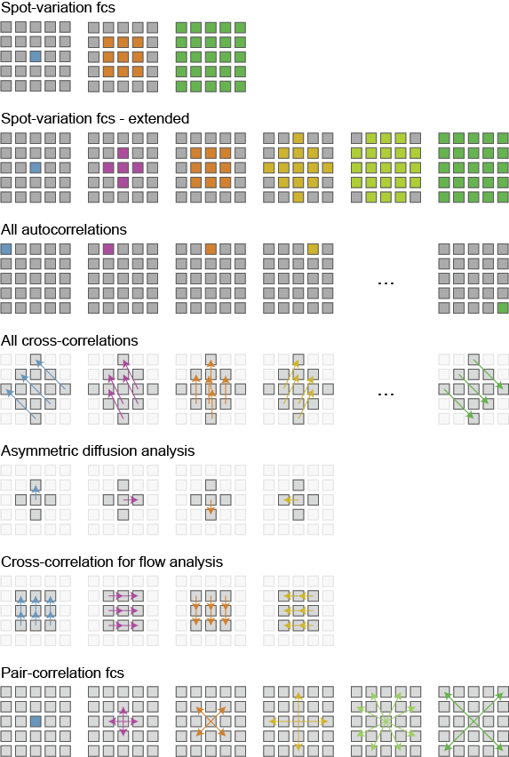

# BrightEyes-FFS-GUI

A graphical user interfact for analysing Fluorescence Correlation Spectroscopy (FCS) and Fluorescence Fluctuation Spectroscopy (FFS) data with array detectors. Built upon the BrightEyes-FFS python package (https://github.com/VicidominiLab/BrightEyes-FFS).

----------------------------------

## Installation

For running the executable (Windows), download the GUI from and run main.exe.

For developers, (i) create a new venv and install the BrightEyes-FFS package (https://pypi.org/project/brighteyes-ffs/) using pip:

    pip install brighteyes-ffs

(ii) clone the BrightEyes-FFS-GUI GitHub repository:

	git clone https://github.com/VicidominiLab/BrightEyes-FFS-GUI.git
	
(iii) run main.py in the new venv:

	python main.py

## Using the GUI

### Step 1: loading an image [optional]

If the FFS measurements were done in a cell, the GUI allows an image of the cell to be loaded. To import an image, click File > Open new image. Supported file type are .h5 (with key 'data') and .tiff. If the data have more than 2 dimensions, the software will sum over all dimensions except 2.

### Step 2: loading an FFS file

For each image, multiple FFS files can be loaded, e.g., corresponding to different positions in the cell. Click on the *New file* button in the middle panel to load a raw data file. Supported file types are .h5, .tiff, and .czi. To use the GUI only for fitting a pre-calculated correlation function, one can directly import a correlation function from a .csv file. Make sure the .csv file contains two columns, corresponding to lag time (s) and correlation values, respectively.

### Step 3: Calculating the correlation curves

In the top right panel, choose the analysis type (e.g., Spot-variation FCS). The option *precision* defines the number of points for which the correlation is calculated. The higher this number, the more points G contains. The option *Chunk size* contains the duration of a single chunk of data for which the correlation is calculated. E.g. for a 100 s time trace, *Chunk size*=20 will result in 5 correlations from a 20 s time trace each. Choose the *algorithm* used to calculate the correlation and the detector type. Click on *Calculate now*.

The figure below shows the possible auto- and cross-correlations that can be calculated. A colored detector element represents the autocorrelation of that channel. Multiple colored detector elements in the same micro-image represent summing over these channels before calculating the autocorrelation. An arrow between two detector elements represents cross-correlation between the respective channels. Multiple arrows means averaging the corresponding cross-correlations. Lighter-grey colored detector elements are not used for this analysis.

### Step 4: Fitting the correlation curves

Scroll through the time trace and check the correlation curves for each chunk. Remove bad chunks by ticking the check box *Chunk on*. Click on *Show average all active chunks*. Choose a fit model from the *Fit analysis* panel. Tick the boxes of the parameters that have to be fitted and choose starting values for all (fixed and fitted) parameters. E.g., for spot-variation FCS with 3 curves, write *1, 7, 12* in the box for *N* to have these three values as starting parameters. Choose the fit range, expressed in terms of data point number, and click *New fit*.

There are several *special* types of analysis, which are not simply fitting curves to a model. These include *Asymmetry heat map*, which requires the *Asymmetric diffusion analysis* in the *Calculate correlations* panel first, and *Flow heat map*, which requires the calculation of *Cross-correlation for flow analysis*.

### Step 5: Plotting the diffusion law

Enter the values for the beam waist or *D* in the *Diffusion analysis* panel, and click on *Update*.

### Step 6: Save the session

Click on *File > Save session as...* to save the analysis into an *.ffs* file for later use. The *.ffs* file contains all images loaded into the GUI, and for each data file, all time traces, correlation curves, fits, and diffusion law curves are stored. The *.ffs* file is a *hidden* .h5 file and can be opened in Python as follows:

	from brighteyes_ffs.fcs_gui.restore_session import restorelib
	lib = restorelib("myfile.ffs")

Use the read_ffs library for quick plotting of data stored in a session file:

	from brighteyes_ffs.fcs_gui.read_ffs import read_ffs_file, read_g_from_ffs
	g, tau, g_fit, tau_fit = read_g_from_ffs("myfile.ffs", read='active') # read the correlations and fits that were active at the moment of saving the session file
	# Say the user has loaded 1 image, with two FCS files. The second FCS file contains three correlations, and the third correlation was fit four times, then you can load a specific correlation and fit as follows:
	g, tau, g_fit, tau_fit = read_g_from_ffs("myfile.ffs", read=[0, 1, 2, 3]) # read the third fit for the second correlation curve for the first FCS file for the 0th image.
	g = read_ffs_file("myfile.ffs", read='active', returnObj='G') # read the active correlation as an object

### Step 7: Create a Jupyter Notebook

Click on *Tools > Create Jupyter Notebook*. A notebook, with the same analysis as performed in the GUI, is automatically generated and opened. Alternatively, click on *Tools > Plot in Jupyter Notebook* to generate a notebook that reads the result from the GUI for plotting only.

## Changing the GUI

### Adding a new detector type

Open the .ui file in Qt Designer and add a new name to the Detector QComboBox. Convert the .ui file to .py using the following code.

	pyuic5 brighteyes_ffs_3.ui -o pyqt_gui_brighteyes_ffs.py

Add the new detector type to all correlations in FFS_GUI > functions > correlations, e.g. for spot-variation FCS:

	if det_type='My New Detector':
		elements = ['central', 'sum1', 'sum2'] # insert the names of the correlations that will be calculated
		listOfG = [9, 'C9+4+10', 'C9+4+10+8+7+6+5+3+2+1+0'] # insert the channel numbers that will be summed before calculating the correlation

### Adding a new correlation type

Add a new .py file to the correlations folder. The file should have the following syntax:

	def get_params(det_type='Square 5x5'):
		if det_type == 'Square 5x5':
			elements = ['central', 'sum3', 'sum5']
			listOfG = ['central', 'sum3', 'sum5']
		else:
			# airyscan
			elements = ['central', 'ring1', 'ring2']
			listOfG = [9, 'C9+4+10', 'C9+4+10+8+7+6+5+3+2+1+0']
		
		return {
			"mode"       : 'My New Correlation Type',
			"elements"   : elements,
			"listOfG"    : listOfG,
			"shortlabel" : 'NewCorr',
		}

### Adding a new fit function

Add a new .py file to the fitfunctions folder. The file should have the following syntax:

	from brighteyes_ffs.fcs.fcs_fit import my_new_fit_function # import the fit function here
	def get_params():
		return {
			"model"                : 'The Name of My New Fit Function',
			"shortlabel"           : 'shortname',
			"paramNames"           : ["N", "Tau 1 (ms)", "Tau 2 (ms)", "Fraction species 1", "Rel.brightness 1", "Triplet fraction", "Triplet time (µs)", "Offset", "A", "B"],
			"paramFittable"        : [True, True, True, True, True, True, True, True, False, False], # False for parameters that should never be fittable
			"paramDefvalues"       : [1, 0.1, 1, 0.5, 1, 0, 1, 0], # Default values for the parameters that are set so True
			"allparamDefvalues"    : [-1, -1, -1, -1, -1, -1, -1, -1, 1, 0], # -1 for True parameters, default values for the other parameters
			"paramFactors10"       : [1, 1, 1, 1, 1, 1, 1, 1, 1, 1], # Multiplication factors for all parameters (to convert to SI e.g.)
			"paramMinbound"        : [0, 5e-2, 5e-2, 0, 0, 0, 0, -1e2, 0, 0], # Minimum bounds for all paramters
			"paramMaxbound"        : [1e6, 1000, 1000, 1, 1e6, 1, 1e6, 1e6, 1e6, 1e6], # Maximum bounds for all paramters
			"fitfunctionName"      : my_new_fit_function,
			"fitfunctionParamUsed" : [0, 1, 2, 3, 4, 5, 6, 7, 8, 9] # Usually a list from 0 to N-1 with N the total number of parameters.
		}

The fit function itself should have the following behavior:

	def my_new_fit_function(fitparamStart, fixedparam, fit_info, tau, yexp, weights=1):
    """
    Parameters
    ----------
    fitparamStart : 1D np.array
        List with starting values for the fit parameters:
        order: [N, tauD1, tauD2, F, alpha, T, tautrip, SF, offset, A, B]
        E.g. if only N and tauD1 are fitted, this becomes a two
        element vector [1, 1e-3].
    fixedparam : 1D np.array
        List with values for the fixed parameters:
    fit_info : 1D np.array
        np.array boolean vector with always 11 elements
        1 for a fitted parameter, 0 for a fixed parameter
        E.g. to fit N and tau D this becomes [1, 1, 0, 0, 0, 0, 0, 0, 0, 0, 0]
    tau : 1D np.array
        Vector with tau values.
    yexp : 1D np.array
        Vector with experimental autocorrelation.
    weights : 1D np.array, optional
        Weights. The default is 1.

    Returns
    -------
    res : 1D np.array
        Residuals.

    """
    
    fitparam = np.float64(np.zeros(11))
    fitparam[fit_info==1] = fitparamStart
    fitparam[fit_info==0] = fixedparam
    
    # convert to SI
    N = fitparam[0]
    tauD1 = 1e-3 * fitparam[1] # ms to s
    tauD2 = 1e-3 * fitparam[2] # ms to s
    F = fitparam[3]
    alpha = fitparam[4]
    T = fitparam[5]
    tautrip = 1e-6 * fitparam[6] # s
    SF = fitparam[7]
    offset = fitparam[8]
    A = 1e-6 * fitparam[9]
    B = -fitparam[10]

    # calculate theoretical autocorrelation function
    FCStheo = my_function_for_calculating_g(tau, N, tauD1, tauD2, F, alpha, T, tautrip, SF, offset, A, B)
    
    # calculate residuals
    res = yexp - FCStheo
    
    # calculate weighted residuals
    res *= weights
    
    return res

### Making a Windows executable

If you added files in the correlations or fitfunctions folder, these need to be manually added to respectively correlation_functions.py and fitmodels.py before making the GUI. For correlation functions, add the following code to list_of_correlation_functions()

	from functions.correlations.my_new_correlation_function import get_params
        params = get_params()
        correlation = CorrelationFunction()
        correlation.set_params(params)
        modename = correlation.mode
        listOfCorrelations.append(modename)

And add the following code to get_correlation_object_from_name()

	from functions.correlations.my_new_correlation_function import get_params
        params = get_params(det_type)
        correlation = CorrelationFunction()
        correlation.set_params(params)
        modename = correlation.mode
        if name == modename:
            return correlation

Do the same for new fit models. In list_of_fit_models(), add:

	from functions.fitfunctions.my_new_fit_function import get_params
        params = get_params()
        fitmodel = FitModel()
        fitmodel.set_params(params)
        modelname = fitmodel.model
        fitmodels.append(modelname)

And under get_fit_model_from_name(), add:

	from functions.fitfunctions.my_new_fit_function import get_params
        params = get_params()
        fitmodel = FitModel()
        fitmodel.set_params(params)
        modelname = fitmodel.model
        if name == modelname:
            return fitmodel

Open anaconda prompt and activate the right python environment, go to the folder in which main.py is located and execute

	pyinstaller main.spec

If there is an error with pydantic, make sure to install an older version of pydantic:

	pip install "pydantic<2.0"

The executable is located in the newly created dist folder. The executable needs access to the files folder, so make sure both are located in the same parent directory.

## License

Distributed under the terms of the [GNU GPL v3.0] license,
"BrightEyes-FFS" is free and open source software

## Contributing

Do you want to contribute? Great!
Contributing works best if you creat a pull request with your changes.

1. Fork the project.
2. Create a branch for your feature: `git checkout -b my-new-feature`
3. Commit your changes: `git commit -am 'My new feature'`
4. Push to the branch: `git push origin my-new-feature`
5. Submit a pull request!
